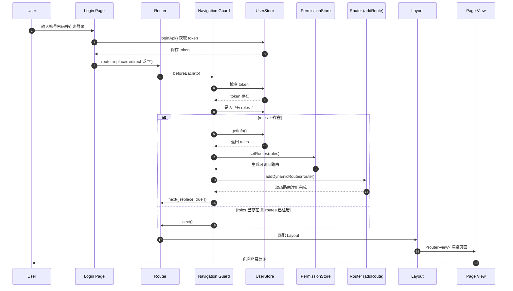

# 一次 Vue 后台项目中“登录后 404”的完整排错与修复

> 我已经帮你整理成 **可以直接发布的博客版本**
> 你只需要微调项目名即可

---

## 1️⃣ 问题背景

在开发一个基于 **Vue 3 + Vue Router + Pinia** 的后台系统时，我遇到了一个非常“诡异”的问题：

* 登录成功后，**首次进入页面显示 404**
* 点击「返回首页」后页面又能正常显示

这个问题 **刷新能好、二次跳转能好**，但首次进入不行。

---

## 2️⃣ 初步现象分析

这类问题通常意味着：

> **页面跳转发生时，路由系统尚未准备完成**

在后台系统中，常见的“未准备完成”包括：

* 动态路由尚未注册（`addRoute` 还没执行）
* 权限信息（roles）尚未获取
* Layout 已渲染，但 router 中还不存在目标路由

---

## 3️⃣ 项目中的路由架构

项目采用了**权限路由 + 动态注入**的设计：

* `constantRoutes`

    * login / 404 / dashboard 等基础路由
* `dynamicRoutes`

    * chat / knowledge / tasks / mcp 等业务模块
* `permissionStore`

    * 根据 roles 过滤动态路由
* `router.beforeEach`

    * 在合适时机执行 `router.addRoute`

---

## 4️⃣ 问题的根本原因

### ❌ 错误时序（问题版本）

```txt
登录成功
 ↓
router.push("/dashboard")
 ↓
beforeEach 执行
 ↓
此时动态路由尚未 addRoute
 ↓
router 中不存在 /dashboard
 ↓
命中 404 alias
```

也就是说：

> **登录成功 ≠ 路由就绪**

---

## 5️⃣ 正确的工程级时序

### ✅ 正确流程应当是：

```txt
登录成功
 ↓
获取用户信息（roles）
 ↓
permissionStore.setRoutes
 ↓
router.addRoute（动态注入）
 ↓
replace 重新进入目标路由
 ↓
Layout 渲染
 ↓
页面展示
```

### 登录 → 权限 → 路由 → Layout → 渲染
「完整时序图（Mermaid）」


### 3 个“关键节点”

1. **`addRoute` 一定发生在页面渲染之前**
2. **`replace: true` 是为了让新注册的路由重新匹配**
3. **Layout 并不负责权限，只是“容器”**
---

---

## 6️⃣ 关键修复点一：动态路由只注册一次

在 `permissionStore` 中增加状态位：

```ts
const isRoutesAdded = ref(false)

const addDynamicRoutes = (router: Router) => {
  if (isRoutesAdded.value) return
  addRoutes.value.forEach(route => {
    router.addRoute(route)
  })
  isRoutesAdded.value = true
}
```

这是**防止重复 addRoute 的“幂等锁”**。

---

## 7️⃣ 关键修复点二：路由守卫中的时序控制

在 `beforeEach` 中，必须确保：

* roles 已存在
* 动态路由已注册

否则继续执行注册逻辑：

```ts
if (userStore.roles.length !== 0 && permissionStore.isRoutesAdded) {
  return true
}
```

并在注册完成后：

```ts
return { ...to, replace: true }
```

确保新路由表被重新匹配。

---

## 8️⃣ 为什么 `replace: true` 很重要？

因为：

* 当前这次导航，发生在“旧路由表”上
* 新注册的路由 **不会自动重新匹配**
* 必须显式触发一次 replace 才能生效

这是 Vue Router 动态路由机制中 **非常容易被忽略的一点**。

---

## 9️⃣ 最终收获与总结

这次排错让我真正理解了：

* Vue Router 中：

    * **路由是否存在**
    * 和 **是否登录**
    * 是两个不同维度的问题
* 动态路由系统中：

    * **时序比功能本身更重要**
* Layout 只是容器：

    * 真正决定页面能否渲染的是 **router.addRoute 的时机**

---

## 10️⃣ 一句话工程总结（面试级）

> 在基于权限的动态路由系统中，必须在页面跳转前完成动态路由的生成与注册，否则首次导航会命中兜底路由。通过在路由守卫中控制路由注入时机，并配合 replace 重新匹配，可以彻底解决登录后 404 与首次不渲染的问题。

---
